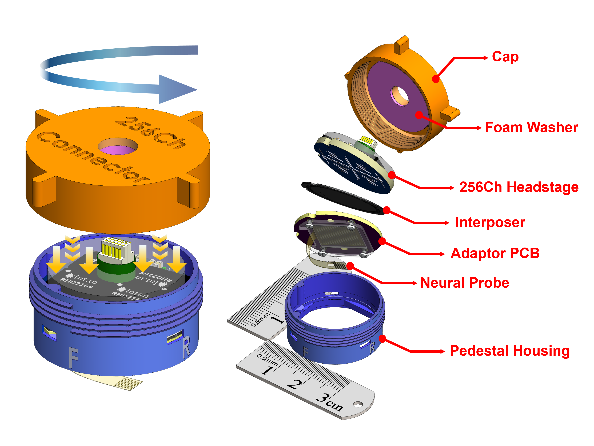
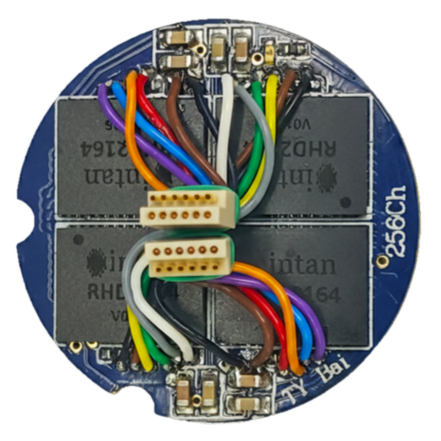

<link rel="preconnect" href="https://fonts.googleapis.com">
<link rel="preconnect" href="https://fonts.gstatic.com" crossorigin>

  

    <a href="https://tianyu-bai.github.io/E-Link">
      🌐 Click here to view the interactive website
    </a>
  

  
  
  
  
  
  

  <h1 class="header-sync-pulse">
    
      
    
  </h1>

  
<h2 class="sub-title">
  An Open-Source, Elastomer Interconnection-based 
   Connector for Flexible Neural Interfaces
</h2>

    
    
    
     
 

  

  
 
 

   <b>Mating Dynamics (left) and Structural Breakdown (right) of the E-Link(256) </b>
 

## 🔬 Interactive 3D Model: E-Link Headstage Integration
 

  <model-viewer
    class="custom-model-viewer"
    src="{{ '/Videos/On skull_3.16MB.glb' | relative_url }}"
    alt="E Link on Skull 3D Model"
    loading="lazy"   reveal="manual"
    poster="{{ '/Images/poster.webp' | relative_url }}"
    camera-controls interpolation-decay="200" bounds="tight" field-of-view="30deg" auto-rotate  rotation-per-second="15deg"
    interaction-prompt="none" environment-image="neutral" exposure="0.75" shadow-intensity="0" tone-mapping="commerce">

      

      

      

      

      

      

      

        

        
INITIALIZING 3D SIGNAL...

        
[ SCROLL OR CLICK TO REVEAL ]

      

    

    

Copyright © 2026 Tianyu Bai

  ↺ Rotate: Drag
  Zoom: Ctrl + 🖱 Wheel/Trackpad Pinch
  Zoom: Pinch

  

    
👉

    
👈

  

  

    Ctrl + 🖱️Wheel to Zoom
    Pinch with two fingers to Zoom
  

      

👆

      
Drag to Rotate

    

    
    <button class="reset-btn"
  onclick="
    const mv = this.closest('model-viewer');
    mv.setAttribute('camera-orbit','45deg 55deg auto');
    mv.setAttribute('field-of-view','30deg');
  ">
      ⟲ Reset View
    </button>
  </model-viewer>

## 🔬 E-Link – 3D Interactive View
 

  <model-viewer
    class="custom-model-viewer"
    src="{{ '/Videos/Whole_2.34MB.glb' | relative_url }}"
    alt="E Link 3D Model"
    loading="lazy"       reveal="manual"
    poster="{{ '/Images/poster.webp' | relative_url }}"
    camera-controls interpolation-decay="200" bounds="tight" field-of-view="30deg" auto-rotate  rotation-per-second="15deg"
    interaction-prompt="none" environment-image="neutral" exposure="0.75" shadow-intensity="0" tone-mapping="commerce">

   

      

      

      

      

      

      

        

        
INITIALIZING 3D SIGNAL...

        
[ SCROLL OR CLICK TO REVEAL ]

      

    

    
    
Copyright © 2026 Tianyu Bai

    

  ↺ Rotate: Drag
  Zoom: Ctrl + 🖱 Wheel/Trackpad Pinch
  Zoom: Pinch

  

    
👉

    
👈

  

  

    Ctrl + 🖱️Wheel to Zoom
    Pinch with two fingers to Zoom
  

    

      

👆

      
Drag to Rotate

    

    
   <button class="reset-btn"
  onclick="
    const mv = this.closest('model-viewer');
    mv.setAttribute('camera-orbit','45deg 55deg auto');
    mv.setAttribute('field-of-view','30deg');
  ">
      ⟲ Reset View
    </button>
  </model-viewer>

## 🔬 256Ch Customized Headstage – 3D Interactive View

  <model-viewer
    class="custom-model-viewer"
    src="{{ '/Videos/3D_1.85MB.glb' | relative_url }}"
    alt="E-Link 256-Channel Custom Headstage 3D Model" 
    loading="lazy"       reveal="manual"
    poster="{{ '/Images/poster.webp' | relative_url }}"
    camera-controls interpolation-decay="200" bounds="tight" field-of-view="30deg" auto-rotate  rotation-per-second="15deg"
    interaction-prompt="none" environment-image="neutral" exposure="0.75" shadow-intensity="0" tone-mapping="commerce">

      

      

      

      

      

      

      

        

        
INITIALIZING 3D SIGNAL...

        
[ SCROLL OR CLICK TO REVEAL ]

      

    

    
    
Copyright © 2026 Tianyu Bai

    

  ↺ Rotate: Drag
  Zoom: Ctrl + 🖱 Wheel/Trackpad Pinch
  Zoom: Pinch

  

    
👉

    
👈

  

  

    Ctrl + 🖱️Wheel to Zoom
    Pinch with two fingers to Zoom
  

    

      

👆

      
Drag to Rotate

 

   <button class="reset-btn"
  onclick="
    const mv = this.closest('model-viewer');
    mv.setAttribute('camera-orbit','45deg 55deg auto');
    mv.setAttribute('field-of-view','30deg');
  ">
      ⟲ Reset View
    </button>
  </model-viewer>

 

  

    

      

        <svg viewBox="0 0 100 100">
          <circle class="bg-ring" cx="50" cy="50" r="45"></circle>
          <circle class="fg-ring weight-color" cx="50" cy="50" r="45"></circle>
        </svg>
        

          
WEIGHT

          

            0g
          

          
Ultra-light

        

      

    

      

        <svg viewBox="0 0 100 100">
          <circle class="bg-ring" cx="50" cy="50" r="45"></circle>
          <circle class="fg-ring channel-color" cx="50" cy="50" r="45"></circle>
        </svg>
        

          
CHANNELS

          

            0
          

          
High-Density

        

      

    

      

        <svg viewBox="0 0 100 100">
          <circle class="bg-ring" cx="50" cy="50" r="45"></circle>
          <circle class="fg-ring pcb-color" cx="50" cy="50" r="45"></circle>
        </svg>
        

          
PCB LAYERS

          

            0
          

          
Custom Routing

        

      

    

  

## 📖 Overview

**E-Link** (Elastomer Interconnection-based connector) is an open-source, miniature pedestal connector system based on elastomer interconnection. It provides a robust, scalable interface for flexible neural probes, specifically engineered for chronic applications in freely moving animals.

  
 

---

> [!NOTE]
> **Key Innovation:** The system integrates two high-density PCBs, an anisotropic elastomeric contact interface, and a lightweight pedestal housing into a fully integrated, headstage-ready solution.

---

### 📊 Quick Specifications

  <table style="margin-left: auto; margin-right: auto; width: 90%; min-width: 600px; text-align: center; border-collapse: collapse; border: 1px solid #e1e4e8;">
   <thead>
     <tr style="background-color: #f6f8fa; border-bottom: 2px solid #e1e4e8;">
       <th style="padding: 10px; border: 1px solid #e1e4e8;">Specification</th>
       <th style="padding: 10px; border: 1px solid #e1e4e8;">E-Link(256)_V1.0</th>
     </tr>
   </thead>
   <tbody>
     <tr>
       <td style="padding: 8px; border: 1px solid #e1e4e8;"><b>Channel Count</b></td>
       <td style="padding: 8px; border: 1px solid #e1e4e8;">128 or 256 Channels (Single/Dual SPI Port support)</td>
     </tr>
     <tr>
       <td style="padding: 8px; border: 1px solid #e1e4e8;"><b>Total Mass</b></td>
       <td style="padding: 8px; border: 1px solid #e1e4e8;">6.6 g (with housing) 2.8 g (without housing)</td>
     </tr>
     <tr>
       <td style="padding: 8px; border: 1px solid #e1e4e8;"><b>Interconnect Type</b></td>
       <td style="padding: 8px; border: 1px solid #e1e4e8;">Solderless Anisotropic Elastomer</td>
     </tr>
     <tr>
       <td style="padding: 8px; border: 1px solid #e1e4e8;"><b>Compatible Acquisition System</b></td>
       <td style="padding: 8px; border: 1px solid #e1e4e8;">Intan Recording Controller (512ch/1024ch) Open-Ephys DAQ box NeuroNexus Smartbox OmniPlex DAQ box</td>
     </tr>
     <tr>
       <td style="padding: 8px; border: 1px solid #e1e4e8;"><b>Housing Material</b></td>
       <td style="padding: 8px; border: 1px solid #e1e4e8;">3D-Printed PEEK / Surgical Grade Resin</td>
     </tr>
   </tbody>
 </table>

---

## ✨ Key Features

  <h3 style="color: #60a5fa; margin-bottom: 20px; font-family: sans-serif;">🌍 Future Application Roadmap </h3>
  
  

  <svg class="connection-lines" viewBox="0 0 600 380" preserveAspectRatio="none" style="z-index: 1;">
  <path class="base-line" d="M300,141 L135,225" stroke="rgba(255,255,255,0.1)" fill="none" /> 
  <path class="base-line" d="M300,141 L300,255" stroke="rgba(255,255,255,0.1)" fill="none" /> 
  <path class="base-line" d="M300,141 L465,225" stroke="rgba(255,255,255,0.1)" fill="none" /> 
  
  <path class="pulse-line line-to-mouse" d="M300,141 L135,225" />
  <path class="pulse-line" d="M300,141 L300,255" />
  <path class="pulse-line line-to-monkey" d="M300,141 L465,225" />
</svg>

 

      

        <svg width="40" height="40" viewBox="0 0 24 24" fill="none" xmlns="http://www.w3.org/2000/svg">
          <path d="M7 2V4M12 2V4M17 2V4M22 7H20M22 12H20M22 17H20M17 22V20M12 22V20M7 22V20M2 17H4M2 12H4M2 7H4M6 6H18V18H6V6ZM9 9V15H15V9H9Z" stroke="#60a5fa" stroke-width="2" stroke-linecap="round" stroke-linejoin="round"/>
        </svg>
      

      
E-Link (256)

    

 

      
  

        

          🐁
        

        
<i>Mouse</i>

        
Housing Removed <b>2.8g Payload</b>

      

  

        

          🐀
        

        
<i>Rat</i>

        
Standard Implant <b>6.6g Total</b>

      

  

        

          🐒
        

        
<i>Macaque</i>

        
High Durability <b>Multi-Array Scalable</b>

      

    

  

* **⚡ 256-Channel High-Density & Scalable Interface** 
  Compact pedestal footprint supporting 256-ch acquisition. The elastomer-based design offers a clear scaling roadmap (up to 1024-ch) without increasing physical size or surgical overhead.

* **🔌 Zero-Force "Soft" Interconnect** 
  By replacing rigid pins with Anisotropic Conductive Elastomer, the system shifts from "insertion" to "compression." This "Gentle yet Firm" philosophy eliminates common failure modes like "bent or broken pins" from the physical level.

* **🎯 Self-Aligning & High Tolerance** 
  Features a high-precision mechanical guidance structure with "Structural Redundancy." It naturally forgives minor manual misalignments, ensuring reliable contact with simple rotation — no microscopic alignment required.

* **🛠️ Modular Maintenance & On-Demand Assembly** 
  Separable "Sandwich" structure (Housing, Adapter PCB, Headstage). Allows independent replacement of damaged modules and supports on-demand chip soldering (e.g., populating 1, 2, or 4 Intan chips) to save research costs.

* **🪶 Detachable Active Electronics for Unburdened Rest** 
  During non-recording periods, the heavy headstage and active electronics can be easily separated from the implanted pedestal. This leaves only a minimal, lightweight passive interface on the skull, significantly 
  reducing the physical payload on the animal and promoting natural behavior between sessions.

* **🐭 Optimized for Chronic In-Vivo Research** 
  Ultra-lightweight core (2.8g without housing) and low-profile design. Fully compatible with commutators, ensuring natural behavior and cable management during long-term recording in freely moving animals.

* **🧪 Surgical-Grade Integration & Anatomical Adaptation** 
  Features textured sidewalls for superior adhesion with dental cement/UV resin. The base curvature can be customized to match the specific cranial profiles of different animals during 3D printing, ensuring a rock-solid isolation chamber that protects delicate probes from fluids and scratching.

---

## 🧩 System Components

 <table border="1" style="border-collapse: collapse; width: 90%; text-align: center;">
   <thead>
     <tr style="background-color: #f2f2f2;">
       <th>Component</th>
       <th>Description</th>
     </tr>
   </thead>
   <tbody>
     <tr>
       <td><b>Pedestal Housing</b></td>
       <td>3D-printed/machined pedestal providing structural support and cranial fixation</td>
     </tr>
     <tr>
       <td><b>Customized 256Ch Headstage</b></td>
       <td>Form-factor optimized recording interface for high-density 128/256-channel signal acquisition</td>
     </tr>
     <tr>
       <td><b>Foam Washer</b></td>
       <td>Provides compliant compression to ensure uniform electrical contact across the elastomeric interface</td>
     </tr>
     <tr>
       <td><b>Adapter PCB</b></td>
       <td>High-density 4-layer PCB for routing signals from thin-film probes to headstage ball array pattern</td>
     </tr>
     <tr>
       <td><b>Surgical Cap</b></td>
       <td>Protective enclosure preserving electrical and mechanical integrity throughout chronic experiments</td>
     </tr>
   </tbody>
 </table>

---

### 🛠 Bill of Materials (BOM) of the headstage

  
  

    <b>Assembled 256-Channel Headstage (Top View)</b>
  

  
  

    <b> 4-Layer Routing Structure (Top to Bottom)</b>
  

  <table style="margin-left: auto; margin-right: auto; width: 90%; min-width: 600px; text-align: center; border-collapse: collapse; border: 1px solid #e1e4e8;">
   <thead>
     <tr style="background-color: #f6f8fa; border-bottom: 2px solid #e1e4e8;">
       <th style="padding: 10px; border: 1px solid #e1e4e8; text-align: center;">Component</th>
       <th style="padding: 10px; border: 1px solid #e1e4e8; text-align: center;">Description</th>
       <th style="padding: 10px; border: 1px solid #e1e4e8; text-align: center;">Qty</th>
       <th style="padding: 10px; border: 1px solid #e1e4e8; text-align: center;">Package</th>
       <th style="padding: 10px; border: 1px solid #e1e4e8; text-align: center;">Notes</th>
     </tr>
   </thead>
   <tbody>
     <tr>
       <td style="padding: 8px; border: 1px solid #e1e4e8; text-align: center;"><b>Amplifier IC</b></td>
       <td style="padding: 8px; border: 1px solid #e1e4e8; text-align: center;">Intan RHD2164</td>
       <td style="padding: 8px; border: 1px solid #e1e4e8; text-align: center;">4</td>
       <td style="padding: 8px; border: 1px solid #e1e4e8; text-align: center;">BGA</td>
       <td style="padding: 8px; border: 1px solid #e1e4e8; text-align: center;"><b>💡 Tip:</b> Ensure correct orientation</td>
     </tr>
     <tr>
       <td style="padding: 8px; border: 1px solid #e1e4e8; text-align: center;"><b>SPI Connector</b></td>
       <td style="padding: 8px; border: 1px solid #e1e4e8; text-align: center;">Omnetics A7621</td>
       <td style="padding: 8px; border: 1px solid #e1e4e8; text-align: center;">2</td>
       <td style="padding: 8px; border: 1px solid #e1e4e8; text-align: center;">-</td>
       <td style="padding: 8px; border: 1px solid #e1e4e8; text-align: center;">12-wire cable harness (32 AWG)</td>
     </tr>
     <tr>
       <td style="padding: 8px; border: 1px solid #e1e4e8; text-align: center;"><b>Resistors</b></td>
       <td style="padding: 8px; border: 1px solid #e1e4e8; text-align: center;">Standard SMD</td>
       <td style="padding: 8px; border: 1px solid #e1e4e8; text-align: center;">7</td>
       <td style="padding: 8px; border: 1px solid #e1e4e8; text-align: center;">0402</td>
       <td style="padding: 8px; border: 1px solid #e1e4e8; text-align: center;">LVDS Configuration</td>
     </tr>
     <tr>
       <td style="padding: 8px; border: 1px solid #e1e4e8; text-align: center;"><b>Capacitors</b></td>
       <td style="padding: 8px; border: 1px solid #e1e4e8; text-align: center;">Standard SMD</td>
       <td style="padding: 8px; border: 1px solid #e1e4e8; text-align: center;">8</td>
       <td style="padding: 8px; border: 1px solid #e1e4e8; text-align: center;">0603</td>
       <td style="padding: 8px; border: 1px solid #e1e4e8; text-align: center;">LVDS Configuration</td>
     </tr>
     <tr>
       <td style="padding: 8px; border: 1px solid #e1e4e8; text-align: center;"><b>Power LED</b></td>
       <td style="padding: 8px; border: 1px solid #e1e4e8; text-align: center;">Green LED</td>
       <td style="padding: 8px; border: 1px solid #e1e4e8; text-align: center;">1</td>
       <td style="padding: 8px; border: 1px solid #e1e4e8; text-align: center;">0402</td>
       <td style="padding: 8px; border: 1px solid #e1e4e8; text-align: center;">Power Indicator</td>
     </tr>
     <tr>
       <td style="padding: 8px; border: 1px solid #e1e4e8; text-align: center;"><b>Solder Balls</b></td>
       <td style="padding: 8px; border: 1px solid #e1e4e8; text-align: center;">0.4 mm Lead-free</td>
       <td style="padding: 8px; border: 1px solid #e1e4e8; text-align: center;">~300</td>
       <td style="padding: 8px; border: 1px solid #e1e4e8; text-align: center;">-</td>
       <td style="padding: 8px; border: 1px solid #e1e4e8; text-align: center;">For BGA rework/assembly</td>
     </tr>
   </tbody>
 </table>

---

## 👥 Developers and Lab

* **Tianyu Bai** (Lead Designer) 
* **Gen Li, Ph.D.**
* **Hui Fang, Ph.D.** <a href="https://engineering.dartmouth.edu/community/faculty/hui-fang">

This project is developed by the **MINE Lab** at Dartmouth College. 

---

## 📄 Publication

This work is currently **under review** at the *IEEE Journal on Flexible Electronics (JFLEX)*.

The hardware designs and visual assets in this repository correspond directly to the system described in the submitted manuscript. To maintain the integrity of the peer-review process:

* **Full Citation**: A permanent link to the final paper will be updated here immediately upon formal acceptance.
* **Preprint/Full Paper**: *Coming Soon.*
  
* We welcome feedback and collaboration from the neuroengineering community!
 
* **Inquiries**: Thinking about using E-Link in your lab? We know setting up a new system can be tricky. If you have questions about the PCB design or 3D printing, drop us an email or open an issue. We'd love to help you get started!
  * **Support**: [support@ephys.tech](mailto:support@ephys.tech)
  * **Developer (Tianyu)**: [tianyu@ephys.tech](mailto:tianyu@ephys.tech) 

---

## 📑 Citation & DOI

If you utilize these designs, code, or assets in your research, please cite this repository using the persistent DOI provided by Zenodo:

**Current Reference:**
> T. Bai, et al., "E-Link GitHub Repository," v1.0, MINE Lab, Dartmouth College, 2026. 

---

## 🔗 Repository & Downloads

This project is fully open-source. Upon acceptance of the associated paper, the complete dataset comprising **PCB fabrication files (Gerber/NC Drill)**, **BOM**, and **Mechanical CAD** will be accessible via the link below.

 
<b>👇 Bookmark the repository for future downloads:</b>

 
 

---

## 🤝 Acknowledgments

The developers gratefully acknowledge support from the **NIH (R01MH139342)** and the **Dartmouth PhD Innovation Fellowship**. 

Special thanks to the members of the **MINE Lab** and the **Thayer School of Engineering** for their technical support and feedback throughout the development of the E-Link (256) system.

---

## 📜 License

Copyright © 2026 Tianyu Bai 

This project is open-source and available under the **MIT License**. Click the badge below for full license details.

 

   
  

  

    👇 🇨🇳 Chinese Version / 中文版 👇
  

  

   

 

  

    <a href="https://tianyu-bai.github.io/E-Link">
      🌐 点击此处进入交互式网站
    </a>
  

  
  
  
  
  
  

  <h1 class="header-sync-pulse" style="display: flex; align-items: center; justify-content: center; border-bottom: none; margin-bottom: 5px; font-size: 2.2em; font-weight: 800; letter-spacing: -1px; font-family: 'Inter', 'Noto Sans SC', sans-serif;">
    
    <svg width="45" height="45" viewBox="0 0 24 24" fill="none" xmlns="http://www.w3.org/2000/svg" style="margin-right: 15px;">
      <path d="M10 13a5 5 0 0 0 7.54.54l3-3a5 5 0 0 0-7.07-7.07l-1.72 1.71" stroke="url(#icon-gradient-zh)" stroke-width="2.5" stroke-linecap="round" stroke-linejoin="round"/>
      <path d="M14 11a5 5 0 0 0-7.54-.54l-3 3a5 5 0 0 0 7.07 7.07l1.71-1.71" stroke="url(#icon-gradient-zh)" stroke-width="2.5" stroke-linecap="round" stroke-linejoin="round"/>
      <defs>
        <linearGradient id="icon-gradient-zh" x1="0%" y1="0%" x2="100%" y2="100%">
          <stop offset="0%" stop-color="#60a5fa" />
          <stop offset="50%" stop-color="#a78bfa" />
          <stop offset="100%" stop-color="#f472b6" />
        </linearGradient>
      </defs>
    </svg>

    E-Link(易链256)
  </h1>

<h2 class="sub-title">
  一种基于弹性导电体互连技术的 高密度柔性神经接口连接器
</h2>

  

    
    
    
     
  

  

   
  
  

    <b>E-Link易链(256) 的插拔动态（左）和结构分解（右）</b>
  

## 🔬 **E-Link ：3D 交互式集成视图**
 

  <model-viewer
    class="custom-model-viewer"
    src="{{ '/Videos/On skull_3.16MB.glb' | relative_url }}"
    alt="E Link on Skull 3D Model"
    loading="lazy"   reveal="manual"
    poster="{{ '/Images/poster.webp' | relative_url }}"
    camera-controls interpolation-decay="200" bounds="tight" field-of-view="30deg" auto-rotate  rotation-per-second="15deg"
    interaction-prompt="none" environment-image="neutral" exposure="0.75" shadow-intensity="0" tone-mapping="commerce">

    

      

      

      

      

      

      

      

        

        
正在初始化 3D 信号...

        
[ 滑动或点击接入引擎 ]

      

    

    
    
版权所有 © 2026 Tianyu Bai

    
    

      ↺ 旋转：拖拽
  缩放：Ctrl键 + 鼠标滚轮/触控板捏合
  缩放：双指捏合

    

      

👆

      
拖拽以旋转

    

    

  

    
👉

    
👈

  

  

    Ctrl键 + 鼠标滚轮以缩放
    双指捏合屏幕以缩放
  

    
    <button class="reset-btn"
  onclick="
    const mv = this.closest('model-viewer');
    mv.setAttribute('camera-orbit','45deg 55deg auto');
    mv.setAttribute('field-of-view','30deg');
  ">
      ⟲ 重置视角
    </button>
  </model-viewer>

## 🔬 E-Link 三维交互模型

  <model-viewer
    class="custom-model-viewer"
    src="{{ '/Videos/Whole_2.34MB.glb' | relative_url }}"
    alt="E Link 3D Model" 
    loading="lazy"       reveal="manual"
    poster="{{ '/Images/poster.webp' | relative_url }}"
    camera-controls interpolation-decay="200" bounds="tight" field-of-view="30deg" auto-rotate  rotation-per-second="15deg"
    interaction-prompt="none" environment-image="neutral" exposure="0.75" shadow-intensity="0" tone-mapping="commerce">

    

      

      

      

      

      

      

      

        

        
正在初始化 3D 信号...

        
[ 滑动或点击接入引擎 ]

      

    

    
    
版权所有 © 2026 Tianyu Bai

    
    

        ↺ 旋转：拖拽
  缩放：Ctrl键 + 鼠标滚轮/触控板捏合
  缩放：双指捏合

    

      

👆

      
拖拽以旋转

    

    

  

    
👉

    
👈

  

  

    Ctrl键 + 鼠标滚轮以缩放
    双指捏合屏幕以缩放
  

    
    <button class="reset-btn"
  onclick="
    const mv = this.closest('model-viewer');
    mv.setAttribute('camera-orbit','45deg 55deg auto');
    mv.setAttribute('field-of-view','30deg');
  ">
      ⟲ 重置视角
    </button>
  </model-viewer>

 

## 🔬 256通道定制放大器 – 三维交互模型

  <model-viewer
    class="custom-model-viewer"
    src="{{ '/Videos/3D_1.85MB.glb' | relative_url }}"
    alt="E-Link 256-Channel Custom Headstage 3D Model"
    loading="lazy"       reveal="manual"
    poster="{{ '/Images/poster.webp' | relative_url }}"
    camera-controls interpolation-decay="200" bounds="tight" field-of-view="30deg" auto-rotate  rotation-per-second="15deg"
    interaction-prompt="none" environment-image="neutral" exposure="0.75" shadow-intensity="0" tone-mapping="commerce">

    

      

      

      

      

      

      

      

        

        
正在初始化 3D 信号...

        
[ 滑动或点击接入引擎 ]

      

    

    
    
版权所有 © 2026 Tianyu Bai 

    
    

      ↺ 旋转：拖拽
  缩放：Ctrl键 + 鼠标滚轮/触控板捏合
  缩放：双指捏合

    

      

👆

      
拖拽以旋转

    

    

  

    
👉

    
👈

  

  

    Ctrl键 + 鼠标滚轮以缩放
    双指捏合屏幕以缩放
  

    <button class="reset-btn"
  onclick="
    const mv = this.closest('model-viewer');
    mv.setAttribute('camera-orbit','45deg 55deg auto');
    mv.setAttribute('field-of-view','30deg');
  ">
      ⟲ 重置视角
    </button>
  </model-viewer>

  

    
    

      

        <svg viewBox="0 0 100 100">
          <circle class="bg-ring" cx="50" cy="50" r="45"></circle>
          <circle class="fg-ring weight-color" cx="50" cy="50" r="45"></circle>
        </svg>
        

          
重量

          

            0g
          

          
轻量级

        

      

    

    

      

        <svg viewBox="0 0 100 100">
          <circle class="bg-ring" cx="50" cy="50" r="45"></circle>
          <circle class="fg-ring channel-color" cx="50" cy="50" r="45"></circle>
        </svg>
        

          
通道数

          

            0
          

          
高密度采集

        

      

    

    

      

        <svg viewBox="0 0 100 100">
          <circle class="bg-ring" cx="50" cy="50" r="45"></circle>
          <circle class="fg-ring pcb-color" cx="50" cy="50" r="45"></circle>
        </svg>
        

          
PCB 层数

          

            0
          

          
定制化布线

        

      

    

  

## 📖 概览

**E-Link易链**，是一款基于弹性体互连技术（Elastomer Interconnection）的开源微型基座连接系统。它为柔性神经探针提供了稳固且可扩展的接口，专为自由活动动物的长期实验而优化设计

---

> [!NOTE]
> **核心创新：** 我们打造了一种完全一体化的 “即拧即用” 数据采集方案。该系统利用弹性导电介质连接高密度 PCB，并封装于轻量级基座中。其最大的突破在于实现了“零力插拔”。免去使用者用力插拔的动作，有效规避了高密度引脚连接器常见的断针和弯针风险。

---

### 📊 规格参数

  <table style="margin-left: auto; margin-right: auto; width: 90%; min-width: 600px; text-align: center; border-collapse: collapse; border: 1px solid #e1e4e8;">
    <thead>
      <tr style="background-color: #f6f8fa; border-bottom: 2px solid #e1e4e8;">
        <th style="padding: 10px; border: 1px solid #e1e4e8;">规格项目</th>
        <th style="padding: 10px; border: 1px solid #e1e4e8;">E-Link(256)_V1.0</th>
      </tr>
    </thead>
    <tbody>
      <tr>
        <td style="padding: 8px; border: 1px solid #e1e4e8;"><b>通道数</b></td>
        <td style="padding: 8px; border: 1px solid #e1e4e8;">128 或 256 通道 (支持单/双 SPI 端口)</td>
      </tr>
      <tr>
        <td style="padding: 8px; border: 1px solid #e1e4e8;"><b>总质量</b></td>
        <td style="padding: 8px; border: 1px solid #e1e4e8;">6.6 g (含外壳) 2.8 g (不含外壳)</td>
      </tr>
      <tr>
        <td style="padding: 8px; border: 1px solid #e1e4e8;"><b>互连类型</b></td>
        <td style="padding: 8px; border: 1px solid #e1e4e8;">免焊各向异性弹性体</td>
      </tr>
      <tr>
        <td style="padding: 8px; border: 1px solid #e1e4e8;"><b>兼容采集系统</b></td>
        <td style="padding: 8px; border: 1px solid #e1e4e8;">Intan Recording Controller (512ch/1024ch) Open-Ephys DAQ box NeuroNexus Smartbox OmniPlex DAQ box</td>
      </tr>
      <tr>
        <td style="padding: 8px; border: 1px solid #e1e4e8;"><b>外壳材料</b></td>
        <td style="padding: 8px; border: 1px solid #e1e4e8;">3D 打印 PEEK / 手术级树脂</td>
      </tr>
    </tbody>
  </table>

---

## ✨ 核心特性

  <h3 style="color: #60a5fa; margin-bottom: 20px; font-family: sans-serif;">🌍 跨物种适用性展望 </h3>
  
  

  <svg class="connection-lines" viewBox="0 0 600 380" preserveAspectRatio="none" style="z-index: 1;">
  <path class="base-line" d="M300,141 L135,225" stroke="rgba(255,255,255,0.1)" fill="none" /> 
  <path class="base-line" d="M300,141 L300,255" stroke="rgba(255,255,255,0.1)" fill="none" /> 
  <path class="base-line" d="M300,141 L465,225" stroke="rgba(255,255,255,0.1)" fill="none" /> 
  
  <path class="pulse-line line-to-mouse" d="M300,141 L135,225" />
  <path class="pulse-line" d="M300,141 L300,255" />
  <path class="pulse-line line-to-monkey" d="M300,141 L465,225" />
</svg>

    

      

        <svg width="40" height="40" viewBox="0 0 24 24" fill="none" xmlns="http://www.w3.org/2000/svg">
          <path d="M7 2V4M12 2V4M17 2V4M22 7H20M22 12H20M22 17H20M17 22V20M12 22V20M7 22V20M2 17H4M2 12H4M2 7H4M6 6H18V18H6V6ZM9 9V15H15V9H9Z" stroke="#60a5fa" stroke-width="2" stroke-linecap="round" stroke-linejoin="round"/>
        </svg>
      

      
E-Link (256)

    

    

      
      

        

          🐁
        

        
<i>小鼠</i>

        
顶盖移除后 <b>2.8g 载荷</b>

      

      

        

          🐀
        

        
<i>大鼠</i>

        
长期佩戴 <b>6.6g 共计</b>

      

      

        

          🐒
        

        
<i>灵长类</i>

        
高耐久性 <b>可拓展矩阵</b>

      

    

  

  

* **⚡ 256通道高密度与可扩展接口** 
  在有限基座占地面积内实现256通道数据采集。得益于弹性体互连的高集成度，该系统提供了清晰的扩展路径（可达1024通道），且不会增加额外的手术复杂度。

* **🔌 零插拔力，以柔克刚** 
  利用各向异性导电弹性体取代传统刚性插针式连接器。通过“旋紧结构”将扭矩转化为均匀压力，从物理层面彻底规避了高密度连接器常见的断针、弯针等失效模式，让连接不再成为系统可靠性的短板。

* **🎯 自对准与高容错连接** 
  系统具备优异的机械限位与电气容错率。无需微米级精密对齐，只需简单旋紧即可实现稳定连接，极大降低了手动操作的难度和失败风险。

* **🛠️ 模块化维护与按需组装** 
  采用**“三明治”式分离结构**（外壳、适配板、放大器板）。支持损坏模块的单独更换，并允许根据实验通道需求灵活焊接单/多颗芯片，显著降低了科研成本与维护门槛。

* **🪶 电子模块即插即拆，释放动物头部负担** 
  在非记录期间，沉重的头件设备与有源电路可与底座快速分离，仅在颅骨留下极轻量的无源底座。这大幅减轻了动物的物理载荷，最大程度保障了动物在实验间隙的自然活动状态。

* **🐭 专为自由活动动物实验优化** 
  核心组件仅重 2.8g（移除上盖后）。低剖面设计完美适配换向器 (Commutator)，有效管理线缆并确保动物在长期慢性实验中的自然行为，提升动物福利。

* **🧪 手术级一体化与解剖结构适配** 
  侧壁纹理设计极大增强了与牙科水泥或UV树脂的附着力。基座底部的打印弧度可根据不同动物的头部曲线进行定制化调整，从而实现与颅骨的完美贴合，构建出全封闭的防护舱，有效阻隔体液侵蚀并抵抗动物抓挠。

  

  

---

## 🧩 系统组件

  <table border="1" style="border-collapse: collapse; width: 90%; text-align: center;">
    <thead>
      <tr style="background-color: #f2f2f2;">
        <th>组件</th>
        <th>描述</th>
      </tr>
    </thead>
    <tbody>
      <tr>
        <td><b>基座外壳</b></td>
        <td>3D 打印/机械加工的基座，提供结构支撑和颅骨固定</td>
      </tr>
      <tr>
        <td><b>定制化 256Ch 头部放大器</b></td>
        <td>针对高密度 128/256 通道信号采集优化的记录接口</td>
      </tr>
      <tr>
        <td><b>泡沫垫圈</b></td>
        <td>提供柔性压缩层，确保弹性导电基体上方的电气接触均匀</td>
      </tr>
      <tr>
        <td><b>转接PCB</b></td>
        <td>高密度 4 层 PCB，用于将信号从薄膜探针放大器的球栅阵列图案转换</td>
      </tr>
      <tr>
        <td><b>手术保护盖</b></td>
        <td>保护性外壳，在长期慢性实验中保持电气和机械完整性</td>
      </tr>
    </tbody>
  </table>

---

### 🛠 放大器物料清单 (BOM)

  
  

    <b>已组装的 256 通道前置放大器 (顶视图)</b>
  

  
  

    <b> 顶部4层电路板的设计爆炸动图 </b>
  

      

  <table style="margin-left: auto; margin-right: auto; width: 90%; min-width: 600px; text-align: center; border-collapse: collapse; border: 1px solid #e1e4e8;">
    <thead>
      <tr style="background-color: #f6f8fa; border-bottom: 2px solid #e1e4e8;">
        <th style="padding: 10px; border: 1px solid #e1e4e8; text-align: center;">组件</th>
        <th style="padding: 10px; border: 1px solid #e1e4e8; text-align: center;">描述</th>
        <th style="padding: 10px; border: 1px solid #e1e4e8; text-align: center;">数量</th>
        <th style="padding: 10px; border: 1px solid #e1e4e8; text-align: center;">封装</th>
        <th style="padding: 10px; border: 1px solid #e1e4e8; text-align: center;">备注</th>
      </tr>
    </thead>
    <tbody>
      <tr>
        <td style="padding: 8px; border: 1px solid #e1e4e8; text-align: center;"><b>放大器 IC</b></td>
        <td style="padding: 8px; border: 1px solid #e1e4e8; text-align: center;">Intan RHD2164</td>
        <td style="padding: 8px; border: 1px solid #e1e4e8; text-align: center;">4</td>
        <td style="padding: 8px; border: 1px solid #e1e4e8; text-align: center;">BGA</td>
        <td style="padding: 8px; border: 1px solid #e1e4e8; text-align: center;"><b>关键：</b> 确保方向正确</td>
      </tr>
      <tr>
        <td style="padding: 8px; border: 1px solid #e1e4e8; text-align: center;"><b>SPI 连接器</b></td>
        <td style="padding: 8px; border: 1px solid #e1e4e8; text-align: center;">Omnetics A7621</td>
        <td style="padding: 8px; border: 1px solid #e1e4e8; text-align: center;">2</td>
        <td style="padding: 8px; border: 1px solid #e1e4e8; text-align: center;">-</td>
        <td style="padding: 8px; border: 1px solid #e1e4e8; text-align: center;">12 线线束 (32 AWG)</td>
      </tr>
      <tr>
        <td style="padding: 8px; border: 1px solid #e1e4e8; text-align: center;"><b>电阻</b></td>
        <td style="padding: 8px; border: 1px solid #e1e4e8; text-align: center;">标准贴片</td>
        <td style="padding: 8px; border: 1px solid #e1e4e8; text-align: center;">7</td>
        <td style="padding: 8px; border: 1px solid #e1e4e8; text-align: center;">0402</td>
        <td style="padding: 8px; border: 1px solid #e1e4e8; text-align: center;">LVDS 配置</td>
      </tr>
      <tr>
        <td style="padding: 8px; border: 1px solid #e1e4e8; text-align: center;"><b>电容</b></td>
        <td style="padding: 8px; border: 1px solid #e1e4e8; text-align: center;">标准贴片</td>
        <td style="padding: 8px; border: 1px solid #e1e4e8; text-align: center;">8</td>
        <td style="padding: 8px; border: 1px solid #e1e4e8; text-align: center;">0603</td>
        <td style="padding: 8px; border: 1px solid #e1e4e8; text-align: center;">LVDS 配置</td>
      </tr>
      <tr>
        <td style="padding: 8px; border: 1px solid #e1e4e8; text-align: center;"><b>电源 LED</b></td>
        <td style="padding: 8px; border: 1px solid #e1e4e8; text-align: center;">绿色 LED</td>
        <td style="padding: 8px; border: 1px solid #e1e4e8; text-align: center;">1</td>
        <td style="padding: 8px; border: 1px solid #e1e4e8; text-align: center;">0402</td>
        <td style="padding: 8px; border: 1px solid #e1e4e8; text-align: center;">自检状态灯</td>
      </tr>
      <tr>
        <td style="padding: 8px; border: 1px solid #e1e4e8; text-align: center;"><b> BGA锡球 </b></td>
        <td style="padding: 8px; border: 1px solid #e1e4e8; text-align: center;">0.4 mm 无铅</td>
        <td style="padding: 8px; border: 1px solid #e1e4e8; text-align: center;">约300</td>
        <td style="padding: 8px; border: 1px solid #e1e4e8; text-align: center;">-</td>
        <td style="padding: 8px; border: 1px solid #e1e4e8; text-align: center;">用于 BGA 组装</td>
      </tr>
    </tbody>
  </table>

---

## 👥 开发者与实验室

* **白天宇** (主导研发及设计) 
* **李根**
* **方辉教授** <a href="https://engineering.dartmouth.edu/community/faculty/hui-fang">

本项目由达特茅斯学院的 **MINE Lab**团队开发。

---

## 📄 出版物

相关工作目前正在 **IEEE Journal on Flexible Electronics (JFLEX)** 审稿中。

本仓库中的硬件设计和视觉资产直接对应于投稿中描述的系统。

* **完整引用**：正式录用后，最终论文的永久链接将立即在此处更新。
* **预印本/全文**：*即将推出。*
  
* 🤝 **我们诚挚欢迎神经工程科研同行的反馈与合作！**

* **技术咨询**：有意部署 E-Link易链？作为开发者深知从零搭建一套新系统往往伴随诸多挑战。无论您在 PCB 设计、3D 打印制造，还是系统组装方面遇到任何问题，都欢迎随时通过邮件与我们取得联系。将为您提供技术支持！
  * **技术支持**: [support@ephys.tech](mailto:support@ephys.tech)
  * **留言**: [tianyu@ephys.tech](mailto:tianyu@ephys.tech)
---

## 📑 引用与 DOI

如果您在研究中使用了这些设计、代码或资产，需使用 Zenodo 提供的永久 DOI 引用本仓库：

**当前参考：**
> T. Bai, et al., "E-Link GitHub Repository," v1.0, MINE Lab, Dartmouth College, 2026. 

---

## 🔗 仓库与下载

本项目完全开源。相关论文录用后，包含 **PCB 制造文件 (Gerber)** 和 **3D打印文件** 的完整数据集将通过以下链接提供访问。

  
<b>👇 欢迎收藏本仓库以便未来下载：</b>

  
  

---

## 🤝 致谢

开发者感谢 **美国国立卫生研究院 NIH R01MH139342** 和 **达特茅斯博士生创新奖学金 (Dartmouth PhD Innovation Fellowship)** 的支持。

特别感谢 **达特茅斯Thayer工学院** 的相关成员在易链系统开发过程中提供的技术支持和反馈。

---

## 📜 许可协议

版权所有 © 2026 Tianyu Bai 

本项目为开源硬件，在以下许可下可用。点击下方徽章查看完整许可详情。

* **硬件源文件** (KiCad/Gerbers/STL 文件)：在 **MIT 许可** 下授权。
* **文档、原理图 (PDF) 和图像**：在 **CC BY 4.0 国际许可** 下授权。

  

 

